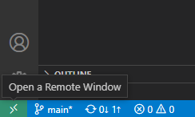

# 🧰 Engineered Singly Linked List Sort 

Project for NCSU CSC 505: Design and Analysis Of Algorithms  
Modeled after the [Engineered quicksort](https://www.sciencedirect.com/science/article/pii/0096055196000057) paper. 

---

## Environment Setup 💻 

1. Ensure you have installed: 
    - [VSCode](https://go.microsoft.com/fwlink/?linkid=830387)
    - [Docker](https://www.docker.com/) (and enabled) 

2. Install the VSCode extension [Dev Containers](https://marketplace.visualstudio.com/items?itemName=ms-vscode-remote.remote-containers). 

3. Open VSCode inside the repo and select the green icon in the bottom-left corner. 

    

4. Select `Reopen in Container` to download and/or open the development container in VSCode. 

    

---

## Usage 🛠️ 

### Compiling the sorting algorithm

```sh
# example: make merge
$ make [insertion|merge|quick]

# output:
# clang++ -std=c++20 -c src/main.cpp -o ./build/main.o
# clang++ -std=c++20 -c src/merge.cpp -o ./build/merge.o
# clang++ -std=c++20 ./build/main.o ./build/merge.o -o ./bin/merge
```

### Running the script

```sh
# Make the script executable
$ chmod +x run_sort.sh

# Execute script
# example: `./run_sort.sh merge < ./data/input_01.txt`
$ ./run_sort.sh [insertion|merge|quick] < [file_path]
```