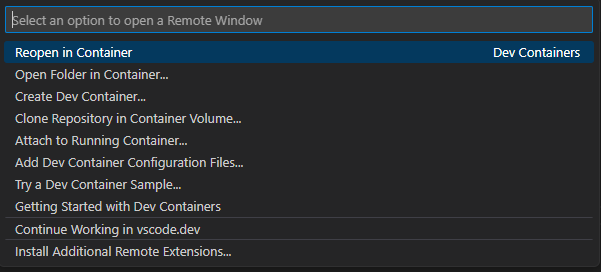

# 🧰 Engineered Singly Linked List Sort 

Project for NCSU CSC 505: Design and Analysis Of Algorithms  
Modeled after the [Engineered quicksort](https://www.sciencedirect.com/science/article/pii/0096055196000057) paper. 

---

## Environment Setup 💻 

1. Ensure you have installed: 
    - [VSCode](https://go.microsoft.com/fwlink/?linkid=830387)
    - [Docker](https://www.docker.com/) (and enabled) 

2. Install the VSCode extension [Dev Containers](https://marketplace.visualstudio.com/items?itemName=ms-vscode-remote.remote-containers). 

3. Open VSCode inside the repo and select the green icon in the bottom-left corner. 

    

4. Select `Reopen in Container` to download and/or open the development container in VSCode. 

    

---

## Usage 🛠️ 

### Compiling the sorting algorithm

```sh
# example: make merge
$ make [insertion|merge|quick]

# output:
# clang++ -std=c++20 -c src/main.cpp -o ./build/main.o
# clang++ -std=c++20 -c lib/LinkedList.cpp -o ./build/LinkedList.o
# clang++ -std=c++20 -c lib/Time.cpp -o ./build/Time.o
# clang++ -std=c++20 -c src/merge.cpp -o ./build/merge.o
# clang++ -std=c++20 ./build/main.o ./build/LinkedList.o ./build/Time.o ./build/merge.o -o ./bin/merge
```

### Running the script

Before execution: 
```sh
# May need to convert Windows line ending to Unix
$ sed -i -e 's/\r$//' run_sort.sh

# Make the script executable
$ chmod +x run_sort.sh
```

Script execution: 
```sh
# Execute script
# example: `./run_sort.sh merge < ./data/input_01.txt`
$ ./run_sort.sh [insertion|merge|quick] < [file_path]

# full output:
# 1
# 2
# ...
# 100
# runtime     SECONDS
# comparisons NUMBER_OF_COMPARISONS
```

For filtered output: 
```sh
# Discard standard error
$ ./run_sort.sh merge < ./data/input_01.txt 2> /dev/null
# output:
# 1
# 2
# ...
# 100

# Discard standard output
$ ./run_sort.sh merge < ./data/input_01.txt 1> /dev/null
# output:
# runtime     SECONDS
# comparisons NUMBER_OF_COMPARISONS

# ---

# Pipe stdout and stderr to separate files
$ ./run_sort.sh merge < ./data/input_01.txt 1> sorted_list.txt 2> benchmark.txt

$ cat sorted_list.txt
# output:
# 1
# 2
# ...
# 100

$ cat benchmark.txt
# output:
# runtime     SECONDS
# comparisons NUMBER_OF_COMPARISONS
```

Running test cases: 
```sh
# Note: make sure to compile and build the program first :)
# Run test cases 
$ make [test-insertion|test-merge|test-quick]

# output:
# Running insertion sort with n = 100:
# ./run_sort.sh insertion < ./data/n-100/input_b-100_s-1.txt 1> ./data/n-100/output_b-100_s-1.txt
# runtime     1.7e-05
# comparisons TODO
# diff --strip-trailing-cr ./data/n-100/expected.txt ./data/n-100/output_b-100_s-1.txt

# Running insertion sort with n = 10000:
# ./run_sort.sh insertion < ./data/n-10000/input_b-10000_s-1.txt 1> ./data/n-10000/output_b-10000_s-1.txt
# runtime     0.235129
# comparisons TODO
# diff --strip-trailing-cr ./data/n-10000/expected.txt ./data/n-10000/output_b-10000_s-1.txt
```